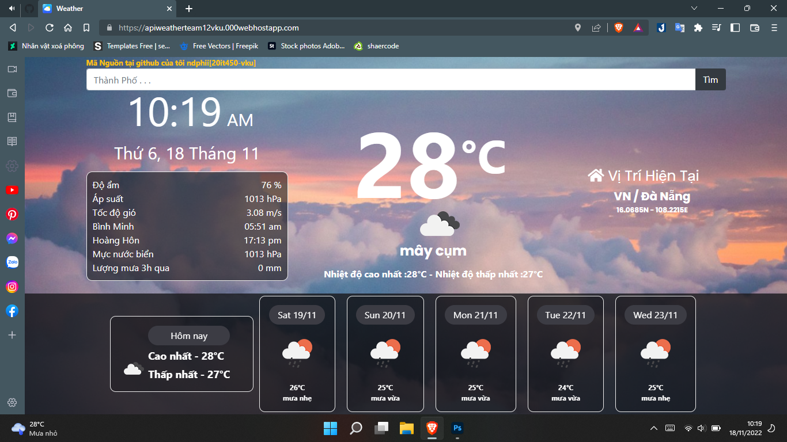

# Apis dự báo thời tiết [ đồ án lập trình mạng ]
- Sử dụng keyapi của " https://openweathermap.org/forecast5 " Openweather dự báo trước 5 ngày và 3h tiếp theo mỗi ngày,thay đổi key ở const API_KEY ='your_key' file js
- Truy vấn tên biến của api từ json bằng cách console.log(data); 
- website https://apiweatherteam12vku.000webhostapp.com/
- Phát triển :https://apiweatherteam12vk.000webhostapp.com/
# ScreenShots
 
